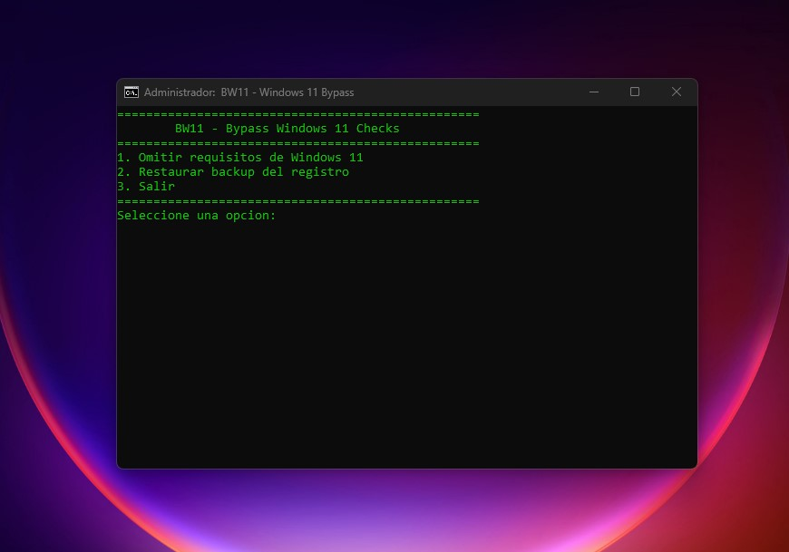

# BW11 - Bypass Windows 11 System Requirements

Este script permite omitir los requisitos del sistema para instalar o actualizar a Windows 11 en hardware no compatible. Está diseñado para ser ejecutado en Windows 10 y modifica el registro de Windows para deshabilitar las comprobaciones de requisitos como TPM, CPU, RAM, almacenamiento y Secure Boot.

## Características

- **Bypass de requisitos**: Omite las comprobaciones de TPM, CPU, RAM, almacenamiento y Secure Boot.
- **Backup del registro**: Crea un backup del registro antes de realizar cualquier modificación.
- **Restauración**: Permite restaurar el registro a su estado original utilizando el backup creado.
- **Interfaz de menú**: Fácil de usar con un menú interactivo en la línea de comandos.

## Requisitos

- Windows 10 (el script está optimizado para este sistema operativo).
- Permisos de administrador para ejecutar el script.

## Instrucciones de uso

1. **Descargar el script**:
   - Descarga el archivo `BW11.bat` desde este repositorio.

2. **Ejecutar como administrador**:
   - Haz clic derecho en el archivo `BW11.bat` y selecciona "Ejecutar como administrador".

3. **Seleccionar una opción**:
   - El script mostrará un menú con las siguientes opciones:
     - **1. Omitir requisitos de Windows 11**: Aplica las modificaciones necesarias en el registro para omitir las comprobaciones de requisitos.
     - **2. Restaurar backup del registro**: Restaura el registro a su estado original utilizando el backup creado.
     - **3. Salir**: Cierra el script.

4. **Reiniciar el sistema**:
   - Después de aplicar los cambios, reinicia tu sistema para que los cambios surtan efecto.

## Advertencia

- **Uso bajo tu responsabilidad**: Modificar el registro de Windows puede tener consecuencias no deseadas. Asegúrate de entender los riesgos antes de ejecutar este script.
- **Backup**: Siempre se crea un backup del registro antes de realizar cualquier modificación. Puedes restaurarlo en caso de problemas.

## Contribuciones

Si deseas contribuir a este proyecto, ¡eres bienvenido! Puedes hacerlo de las siguientes maneras:
- Reportar problemas o sugerir mejoras en la sección de [Issues](https://github.com/nuntius-dev/win11BP/issues).
- Hacer un fork del repositorio y enviar un Pull Request con tus cambios.

## Licencia

Este proyecto está bajo la licencia [MIT](LICENSE). Siéntete libre de usarlo, modificarlo y distribuirlo según los términos de la licencia.

## Créditos

- **Autor original**: Nuntius Dev (optimizado por Nuntius Dev).
- **Inspiración**: Basado en el trabajo de Haitham Aouati.

---

**Nota**: Este script es proporcionado "tal cual", sin garantías de ningún tipo. El autor no se hace responsable de cualquier daño o problema derivado de su uso.
